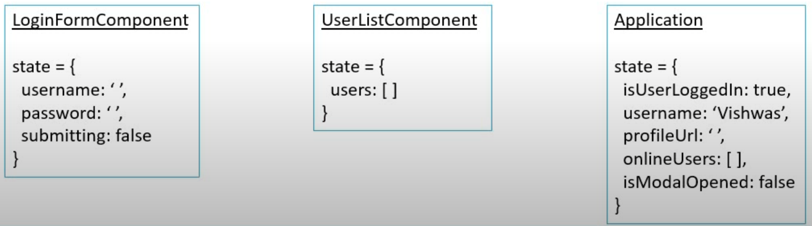

# Summary


# Prerequisites

- Fundamentals of React
- React Tutorial for Beginners on the channel

# What is Redux?

_“Redux is a predictable state container for javascript apps”_

- It’s for JavaScript apps
- It’s a state container
- It’s predictable

### It’s for JavaScript apps

- Redux is not tied to React
- Can be used with React, Angular, Vue, or even Vanilla Javascript
- Redux is a library for Js Apps

### It’s a state container

- Redux stores the state of your application
- Consider a React app - state of a component
- State of an app is the state represented by all the individual of that app



### It’s predictable

- Manage the state of your application in predictable way, redux can help you

## State in React App


## If using React + Redux


# Three Core Concepts

### **_Cake Shop Scenario_**

- **Entities**
  - Shop → Stores cakes on a shelf
  - Shopkeeper → At the front of the store
  - Customer → At the store entrance
- **Activities**
  - Customer → Buy a cake
  - Shopkeeper →
    - Remove a cake from the shelf
    - Receipt to keep track


1. A **store** that holds the state of your application
2. An **action** that describe the changes in the state of the application
3. A **reducer** which actually carries out the state transition depending on the action

# Three Principles

- **First Principle**
  _"The state of your whole application is stored in an object tree within a single store”_
  Maintain our application state in a single object which would be managed by the Redux store
      ***Cake Shop Scenario*** → Let's assume we are tracking the number of cakes on the shelf

```jsx
{
  numberOfCakes: 10;
}
```

- **Second Principle**
  _"The only way to change the state is to emit an action, an object describing what happened”_
  To update the state of your app, you need to let Redux know about that with an action
  Not allowed to directly update the state object
      ***Cake Shop Scenario*** → Let the shopkeeper know about our action — BUY_CAKE

```jsx
{
  type: BUY_CAKE;
}
```

- **Third Principle**
  _"To specify how the state tree is transformed by actions, you write pure reducers”_
  Reducer - (previousState, action) => newState
      ***Cake Shop Scenario*** → Reducer is the shopkeeper

```jsx
const reducer = (state, action) => {
  switch (action.type) {
    case BUY_CAKE:
      return {
        numOfCakes: state.numOfCakes - 1,
      };
  }
};
```


